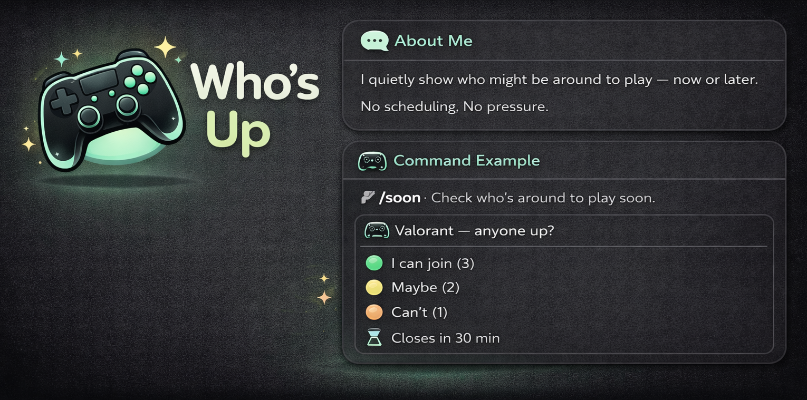

  

<h1 align="center">Who's Up</h1>

  <strong>See who's around — without asking</strong>

  
  
  

## About

A Discord bot that quietly shows who might be around to play — now or later. No scheduling. No pressure.

See the vibe before you ask.

## Features

- `/soon` - Check who's around to play now (closes in 30 min)
- `/later <time>` - Check who's around at a specific time (closes in 24h)
- Reaction-based voting (one vote per user)
- DM notification when enough players are available

## Quick Start

1. **Add the bot to your server**

   [Invite Who's Up](https://discord.com/oauth2/authorize?client_id=1467134752170709241&permissions=75840&integration_type=0&scope=bot+applications.commands)

2. **Use the commands**

   Use `/soon` or `/later 8pm` to start a poll

## Commands

### /soon
Check who might be around to play now.

### /later
Check who might be around at a specific time.

## License

[ISC](LICENSE)
